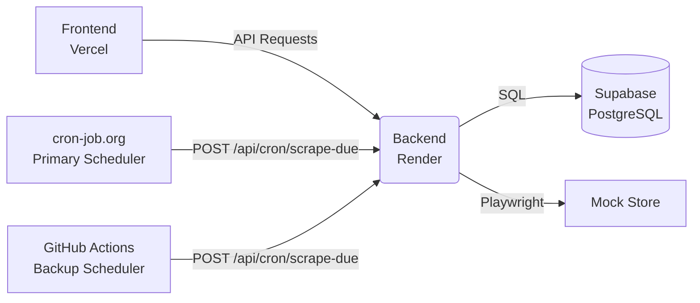

# Price Tracker

A full-stack product price tracker that scrapes INE's mock store at https://demo.inelabteamdev.com using a hybrid approach of lightweight HTTP requests for catalog search and a headless Playwright browser for reliable price extraction.

**Live URLs:**
- **Frontend:** https://price-tracker-eta-self.vercel.app
- **Backend:** https://price-tracker-backend-q11i.onrender.com
- **GitHub:** https://github.com/Heisenberg-tesla/price-tracker

## Architecture



## Tech Stack
- **Frontend:** React 18, Vite, TanStack Query, Recharts, Tailwind CSS (Hosted on Vercel)
- **Backend:** Node.js 20, Express, TypeScript, Playwright (Hosted on Render)
- **Database:** Supabase PostgreSQL
- **Scheduling:** cron-job.org (Primary), GitHub Actions (Backup)

## Local Setup

### Prerequisites
- Node.js 20+
- A Supabase project (for the PostgreSQL database)

### Installation
1. Clone the repository:
   ```bash
   git clone https://github.com/Heisenberg-tesla/price-tracker.git
   cd price-tracker
   ```
2. Install backend dependencies:
   ```bash
   cd backend
   npm install
   ```
3. Install frontend dependencies:
   ```bash
   cd ../frontend
   npm install
   ```

### Configuration
1. In the `backend/` directory, copy `.env.example` to `.env`:
   ```bash
   cp .env.example .env
   ```
2. Fill in the required environment variables (see below).
3. In your Supabase SQL editor, run the `backend/supabase/migrations/001_init.sql` script to create the necessary tables and policies.

### Running the App
1. Start the backend server:
   ```bash
   cd backend
   npm run dev
   ```
2. Start the frontend server (in a new terminal):
   ```bash
   cd frontend
   npm run dev
   ```

## Running Tests
- **Backend:** `cd backend && npm test`
- **Frontend:** `cd frontend && npm test`

## Running Headed Scraper (Local Only)
To visualize the scraping process in a real browser:
```bash
cd backend
npm run scrape:headed -- --product=915
```

## Scraping Schedule
The application relies on external schedulers calling `POST /api/cron/scrape-due`.
- **Primary:** cron-job.org invokes the endpoint every 2 hours.
- **Backup:** A GitHub Action workflow runs periodically.
- **Per-product frequency:** Can be configured via the `scrapeIntervalMinutes` field (5 to 1440 minutes).

## Environment Variables

### Backend (`backend/.env`)

| Variable | Description |
|---|---|
| `PORT` | Server port (default: 4000) |
| `NODE_ENV` | `development`, `test`, or `production` |
| `LOG_LEVEL` | Pino log level (e.g., `info`, `debug`) |
| `SUPABASE_URL` | Your Supabase project URL |
| `SUPABASE_SERVICE_ROLE_KEY` | Service role JWT for backend access |
| `CRON_SECRET` | Secret key for cron authentication |
| `ALLOWED_ORIGINS` | Comma-separated list of allowed CORS origins |
| `HEADLESS` | Set to `true` to run Playwright headlessly |
| `STORE_BASE_URL` | `https://demo.inelabteamdev.com` |
| `MAX_SCRAPE_ATTEMPTS` | Max retries per scrape (default: 3) |
| `CATALOG_CACHE_TTL_MS` | TTL for the catalog cache (e.g., 600000) |
| `STALE_PENDING_MS` | Timeout for pending scrapes (e.g., 600000) |

### Frontend (`frontend/.env`)

| Variable | Description |
|---|---|
| `VITE_API_BASE_URL` | URL of the backend API (e.g., `http://localhost:4000`) |

## Project Structure
```text
price-tracker/
├── backend/
│   ├── src/
│   │   ├── db/          # Supabase client & repository
│   │   ├── routes/      # Express API routes
│   │   ├── scraper/     # Playwright scraper logic
│   │   └── scripts/     # CLI scripts (e.g., headedScrape.ts)
│   ├── supabase/        # Database migrations
│   └── package.json
├── frontend/
│   ├── src/
│   │   ├── components/  # React components
│   │   ├── pages/       # Dashboard and Product Details
│   │   └── services/    # API client
│   └── package.json
├── docs/                # Project documentation
├── render.yaml          # Render deployment config
└── README.md
```
