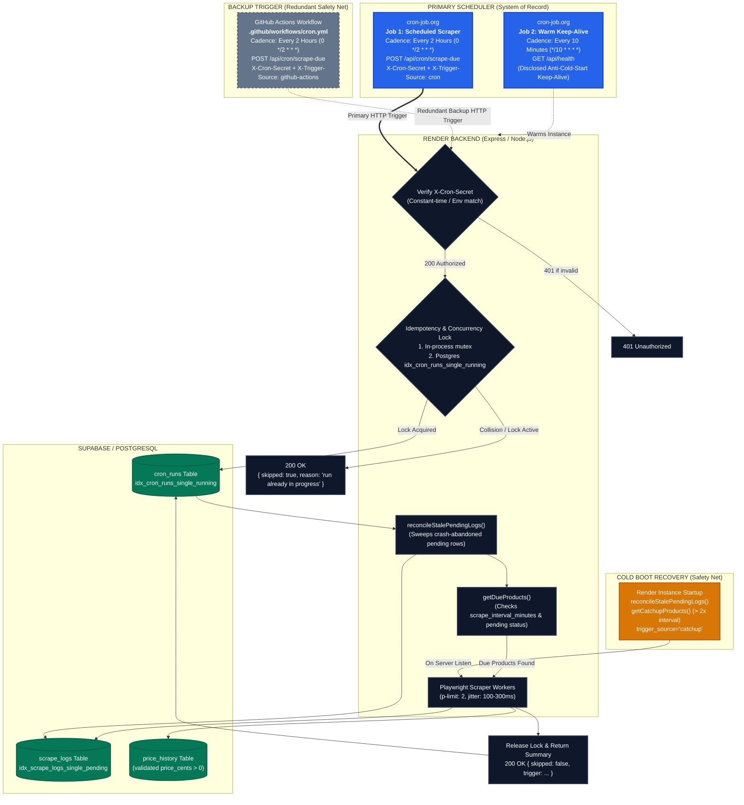

# Free-Tier Scheduling Strategy & Architecture

This document specifies the scheduling architecture, failover mechanisms, concurrency controls, and operational configurations for the Price Tracker platform on Render's free tier.

---

## 1. Architectural Overview



---

## 2. Primary Scheduler: `cron-job.org`

`cron-job.org` serves as the **system of record** for all scheduled price-scraping operations.

### Why an In-Process `setInterval` Loop is Prohibited on Free Tier
Render free-tier web services automatically spin down to zero instances ("sleep") after **15 minutes of inbound HTTP inactivity**. 
- An in-process Node.js scheduler (e.g., `setInterval`, `node-cron`, `agenda`) resides in RAM inside the container. When the container sleeps, the scheduler halts completely. It possesses no capability to wake itself up.
- Using an in-process loop as the primary scheduler is an architectural antipattern on serverless and sleepable free-tier platforms.
- An **external HTTP trigger** wakes up the sleeping container via incoming network traffic, handles instance initialization, executes due tasks, and allows the instance to sleep cleanly once work completes.

### Job 1 Configuration: Primary Scheduled Scraper
- **Title**: `Price Tracker - Scheduled Scrape Trigger`
- **URL**: `https://<your-render-service>.onrender.com/api/cron/scrape-due`
- **HTTP Method**: `POST`
- **Schedule**: Every 2 hours (`0 */2 * * *` in standard 5-part cron syntax)
- **HTTP Headers**:
  - `X-Cron-Secret`: `<your_CRON_SECRET>` (32+ char high-entropy secret matching `backend/.env`)
  - `X-Trigger-Source`: `cron`
  - `Content-Type`: `application/json`
- **Request Timeout**: `180 seconds` (accommodates Render cold-start boot + Playwright browser execution)
- **Redirects**: Follow redirects enabled
- **Retry Policy**:
  - Retry on failure: `Yes`
  - Number of retries: `2 retries`
  - Retry interval: `60 seconds`
- **Failure Notification**:
  - Send email notification after `3 consecutive failures`

### Job 2 Configuration: Deliberate Keep-Alive (Warm Instance)
- **Title**: `Price Tracker - Render Keep-Alive`
- **URL**: `https://<your-render-service>.onrender.com/api/health`
- **HTTP Method**: `GET`
- **Schedule**: Every 10 minutes (`*/10 * * * *`)
- **HTTP Headers**: None required
- **Request Timeout**: `30 seconds`
- **Failure Notification**: Disabled / low priority
- **Disclosed Intent**:
  > **Deliberate Engineering Decision**: This keep-alive ping is a disclosed, transparent mechanism designed to maintain warm container state and prevent 50+ second cold-start delays for scheduled scrapers and end users. It is documented openly as part of our free-tier operational strategy.

---

## 3. Redundant Backup Trigger: GitHub Actions

The repository includes a secondary workflow at [`.github/workflows/cron.yml`](file:///.github/workflows/cron.yml).

### Architectural Role: Secondary Safety Net
This trigger is explicitly designated as a **redundant backup**, whose only purpose is to ensure prices are tracked even if `cron-job.org` suffers a complete service outage or routing partition.

### Why GitHub Actions is NOT the Primary Scheduler
1. **Best-Effort Scheduling**: GitHub Actions scheduled workflows run on shared public runner queues. During peak traffic hours, runs can be delayed by **15 to 60+ minutes**. A guarantee of "every 2 hours" cannot be satisfied by GitHub Actions alone.
2. **Automatic Inactivity Disablement**: GitHub automatically disables scheduled workflows on repositories that have had no git commit activity for **60 consecutive days**. A production monitoring service must not silently deactivate simply because code reached stability.
3. **Execution Cadence**: `cron-job.org` provides dedicated cron daemons with millisecond precision, real-time status dashboards, and explicit webhook alarms.

### Workflow Configuration
- **File**: [`.github/workflows/cron.yml`](file:///.github/workflows/cron.yml)
- **Schedule**: `0 */2 * * *` (same 2-hour cadence) + `workflow_dispatch`
- **Repository Secrets Required**:
  - `CRON_SECRET`: Must match the backend's `CRON_SECRET` environment variable.
  - `RENDER_BACKEND_URL`: `https://<your-render-service>.onrender.com`

---

## 4. Idempotency & Overlap Prevention

Because both `cron-job.org` and GitHub Actions fire on the same 2-hour boundary, their requests may arrive at the Render backend within seconds or milliseconds of each other.

The system prevents double-scraping through **three layers of defense**:

### Layer 1: PostgreSQL `cron_runs` Table Lock
The database schema defines a dedicated run registry with a PostgreSQL unique partial index:
```sql
CREATE TABLE IF NOT EXISTS cron_runs (
    id UUID PRIMARY KEY DEFAULT gen_random_uuid(),
    started_at TIMESTAMPTZ NOT NULL DEFAULT now(),
    finished_at TIMESTAMPTZ NULL,
    status TEXT NOT NULL DEFAULT 'running'
        CHECK (status IN ('running', 'completed', 'failed')),
    trigger_source TEXT NOT NULL DEFAULT 'cron'
        CHECK (trigger_source IN ('cron', 'github-actions', 'manual', 'catchup')),
    ...
);

CREATE UNIQUE INDEX idx_cron_runs_single_running 
    ON cron_runs (status) 
    WHERE status = 'running';
```
- When a cron request arrives, it executes `acquireCronLock(triggerSource)`.
- If another worker or instance is currently executing a run (`status = 'running'`), PostgreSQL rejects the concurrent insert with error code `23505` (unique constraint violation).
- The endpoint catches this violation and immediately responds with **HTTP 200**:
  ```json
  {
    "skipped": true,
    "reason": "run already in progress",
    "trigger": "github-actions"
  }
  ```
- This prevents duplicate scraping cycles while avoiding false alert errors in external monitoring dashboards.

### Layer 2: Synchronous In-Process Mutex
Within the single Node.js runtime, an atomic in-memory mutex (`isCronScrapeDueActive`) prevents microtask/event-loop race conditions when two HTTP sockets arrive at the exact same millisecond before the first DB round-trip finishes.

### Layer 3: Per-Product Interval & Pending Lock
Even if a second scrape cycle began after the first one completed:
1. `getDueProducts()` computes `(now - last_scraped_at) >= scrape_interval_minutes`. If product A was scraped 10 seconds ago by the primary trigger, its interval has not elapsed, so `getDueProducts()` returns an empty list.
2. The database partial unique index `idx_scrape_logs_single_pending` on `scrape_logs(product_id) WHERE outcome = 'pending'` guarantees that no two concurrent scrapes can ever run for the same product simultaneously.

---

## 5. Cold Starts & The Catch-Up Safety Net

### Handling Cold Starts
When Render spins up an instance from sleep:
1. **Lazy & Resilient DB Connections**: The Supabase client initializes without blocking boot. The health ping (`/api/health`) and scraper both tolerate transient connection latency.
2. **Generous Server-Side Timeouts**:
   - `server.setTimeout(300000)`: 5-minute socket timeout prevents Node.js from closing HTTP connections during cold boots and browser downloads.
   - `server.keepAliveTimeout = 65000`: Set higher than Render/Cloudflare reverse proxy timeout (60s) to prevent race conditions during socket reuse.
3. **Honest Stale Reconciliation First**: At the very beginning of both server boot and every `/api/cron/scrape-due` invocation, `reconcileStalePendingLogs()` runs first. If Render previously terminated an instance mid-scrape, the orphaned `pending` log is resolved to `outcome='abandoned'` with clear diagnostics before any new scrape begins.

### Catch-Up Safety Net (Boot Recovery)
If an instance was asleep or suspended for an extended duration (e.g., several hours during maintenance), scheduled triggers may have been missed.
- On boot, after reconciliation completes, the system calls `getCatchupProducts()`.
- A product qualifies for a catch-up scrape if:
  $$\text{now} - \text{last\_scraped\_at} > 2 \times \text{scrape\_interval\_minutes}$$
- Overdue products are scraped once in the background with `trigger_source = 'catchup'`.
- This is explicitly logged and displayed in the UI as a **catch-up recovery event**, distinct from normal cron schedules.

---

## 6. How to Reconfigure Cadences & Intervals

### Changing the Global Trigger Cadence
1. **In `cron-job.org`**:
   - Open Job 1 -> Edit -> Modify Schedule Expression (e.g., change from `0 */2 * * *` [every 2h] to `0 */1 * * *` [every 1h]).
2. **In GitHub Actions**:
   - Edit [`.github/workflows/cron.yml`](file:///.github/workflows/cron.yml) -> Change `cron: '0 */2 * * *'` to match the desired cadence.
3. **Note on Cadence vs. Interval**:
   - The global cron cadence is merely a **trigger pulse**. It queries the database to see which products are due.
   - You can trigger the cron endpoint as often as every 30 minutes without causing excessive scraping, because each product only scrapes when its individual `scrape_interval_minutes` has elapsed.

### Changing Per-Product Scrape Intervals
Each product has its own configurable interval stored in `tracked_products.scrape_interval_minutes` (default: 120 minutes).

To change an individual product's interval via the API:
```bash
PATCH /api/products/:id
Content-Type: application/json

{
  "scrape_interval_minutes": 60
}
```
Available presets in the UI:
- **Fast**: 30 minutes (`30`)
- **Standard**: 2 hours (`120`) — *Default*
- **Relaxed**: 6 hours (`360`)
- **Daily**: 24 hours (`1440`)
